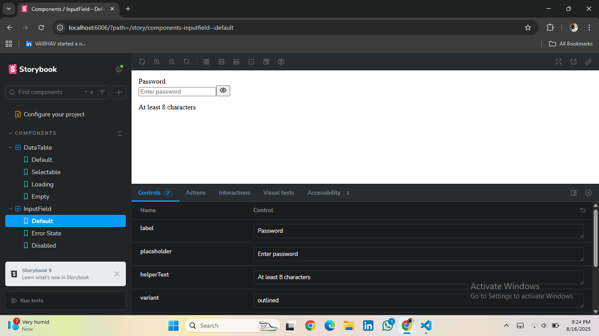

# React + Vite

This template provides a minimal setup to get React working in Vite with HMR and some ESLint rules.

Currently, two official plugins are available:

- [@vitejs/plugin-react](https://github.com/vitejs/vite-plugin-react/blob/main/packages/plugin-react) uses [Babel](https://babeljs.io/) for Fast Refresh
- [@vitejs/plugin-react-swc](https://github.com/vitejs/vite-plugin-react/blob/main/packages/plugin-react-swc) uses [SWC](https://swc.rs/) for Fast Refresh

## Expanding the ESLint configuration

If you are developing a production application, we recommend using TypeScript with type-aware lint rules enabled. Check out the [TS template](https://github.com/vitejs/vite/tree/main/packages/create-vite/template-react-ts) for information on how to integrate TypeScript and [`typescript-eslint`](https://typescript-eslint.io) in your project.

# 🎨 React UI Components Assignment

This project contains two reusable React UI components — **InputField** and **DataTable** — built with **React (Vite + JSX)**, **TailwindCSS**, and **Storybook**.  
The goal of this assignment is to demonstrate scalable component design, modern UI patterns, and proper documentation.

---

## 🚀 Tech Stack

- [React (Vite)](https://vitejs.dev/)
- [TailwindCSS](https://tailwindcss.com/)
- [Storybook](https://storybook.js.org/)
- [Lucide React](https://lucide.dev/) (for icons)

---

## 📸 Screenshots

### InputField Component



### DataTable Component

## 

## 📦 Installation & Setup

Clone the repository:

````bash
git clone https://github.com/BhartiUmale/react-ui-assignment.git
cd react-ui-assignment

----

# # ▶️ Usage

Install dependencies:
```bash
npm install
npm run storybook
npm run dev

````
